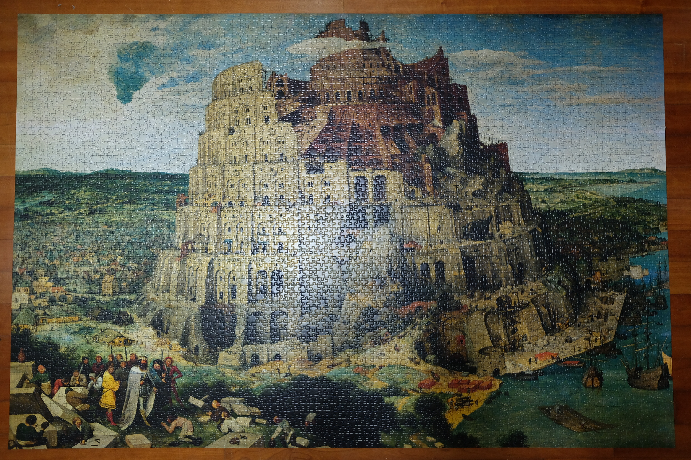

# The Tower of Babel

Languages: [[English](README.md)] [[한국어](README.ko.md)]

I solved ["The Tower of Babel" jigsaw puzzle](https://www.ravensburger.us/products/jigsaw-puzzles/adult-puzzles/the-tower-of-babel-17423/index.html) made by Ravensburger.

## Number of pieces

84 * 60 = 5040

## License

Copyright (c) 2019 Hajun Park

This work is licensed under a [Creative Commons Attribution 4.0 International License](http://creativecommons.org/licenses/by/4.0/).
